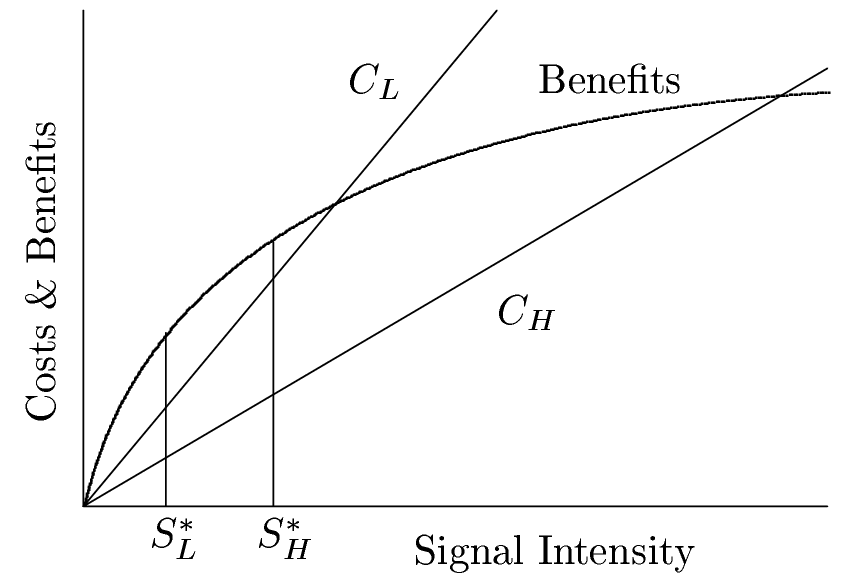
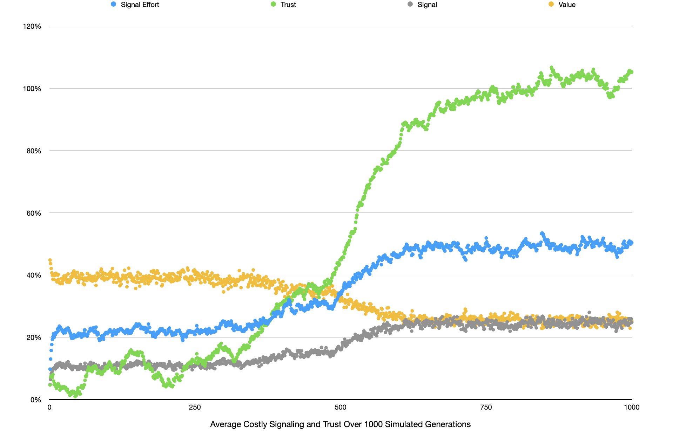

# Evolutionary Costly Signaling Theory Simulation

## Background

This program was written to replicate "costly signaling" theory - the evolutionary claim that signaling fitness and trusting signaling are good evolutionary strategies even when signaling actively competes with fitness.

I started this project when I was getting particularly interested in computer simulations. The first thing that comes to mind when I think of computer simulations (at least the kind that I can create) is evolutionary model simulations. I have this idea from reading Richard Dawkins book the selfish gene which several times references how computer models have validated some evolutionary theories. So, I went to my electronic copy of the selfish gene and searched for any references to simulations.
The first thing that caught my eye was the handicap theory/signaling theory model which actually didn't have a simulation created for it but was proven possible with mathematical formulas. This theory in particular seemed interesting to me because it seems pretty counterintuitive and has just enough complexity that it would be nontrivial but doable to simulate. Indeed it was not too complex to to model Dash my first version of the simulation took about an hour to code - but was certainly non-trivial – the final version of this simulation took dozens of hours of coding and reading and notetaking and formula creating and testing and debugging etc. 

## Costly Signaling Theory

"The handicap principle is a hypothesis proposed by the biologist Amotz Zahavi to explain how evolution may lead to "honest" or reliable signalling between animals which have an obvious motivation to bluff or deceive each other." - Wikipedia

The costly signaling theory, also known as the "good genes theory" or "hanicap principle", proposes that certain traits or behaviors that appear to be a disadvantage in an organism's survival or reproduction may actually be advantageous because they signal the organism's genetic quality to potential mates. The theory suggests that these traits or behaviors, which may be costly in terms of energy or resources, are only displayed by individuals with high-quality genes that can afford the cost. Thus, these traits or behaviors serve as signals of genetic quality to potential mates, who are more likely to choose a mate with these signals. This theory has been applied to a wide range of organisms, including birds, fish, mammals, and insects.

Some examples include:

* Brightly colored or elaborate plumage in birds: These traits may make the birds more visible to predators, but they also signal to potential mates that the individual has high-quality genes that can afford the energy and resources required to produce such extravagant feathers.
*Long tail feathers in peacocks: Peacocks' long tail feathers are heavy and make it harder for them to fly, but they are used during courtship displays to attract females. The females choose the males with the most colorful and largest tail feathers, which is an indicator of good genes.
* Brightly colored ornaments in fish: Many fish species have brightly colored ornaments, such as fins or scales, that make them more visible to predators. But these ornaments also serve as signals of genetic quality to potential mates.
* Exaggerated vocalizations in certain primates: Some primates make loud, exaggerated vocalizations that can be heard from a great distance. These vocalizations are costly in terms of energy and can alert predators to the primate's presence, but they also signal to potential mates that the individual has high-quality genes.

## Results

I ran this simulation with a population of 1000 individuals over 1000 generations. In the chart above, you can see that signaling effort (the amount of energy males spend signaling) immediately increased and increased further as trust increased. Trust also increased as honest signaling increased. Trust maxed out around 100% and honest signaling maxed out around 50%. Value (fitness after adjusting for the energy spent signaling) decreased to about 25%. Signaling effort and trust were inheritable while quality was random between 0 and 1 for each individual. Signal was calculated as quality times signaling effort (e.g. quality of 0.5 x 50% signaling effort = signal of .25), and value was calculated as the remaining quality left after signaling (e.g. quality of .8 - 50% signaling effort = value of .4).

## Observations
This theory relies a lot on a couple nontrivial assumptions. First of all the idea that there is a higher cost for less capable individuals to signal than there is for more capable individuals to signal does a lot of work in this theory. By that I mean that theory actually requires that less capable individuals pay a higher price for the same amount of signaling than more capable individuals, not just that less capable individuals have lost despair. It also implies that less capable individuals inherently cannot signal as much as high quality individuals. In other words if high quality and low quality individuals both signaled as much as possible high quality individuals would send a stronger signal than low quality individuals. If it were the case that any individual spending all of it's effort signaling would look similar, then this theory would not work; or rather, and situations where that is the case signaling and trust are not evolutionarily advantageous
Adding trust as a parameter makes the situation more complicated. Even with the simplest of equations where some value should very clearly approach 50% and 25%, adding trust creates an adversarial relationship between optimal levels for males and females in trust and signaling effort. When trust levels are high it is more advantageous for males to use more effort the signal which then makes their value to the females decrease which causes trust to decrease which makes males who spend relatively low effort signaling have an advantage which causes the value of males to increase and the bus trust to increase and the cycle continues. 

    Disclaimer: I am not a biologist of any kind. I am interested in evolutionary biology, but have basically no experience with academic (rather than pop-science) literature on the subject. I am just an interested nerd who knows how to program.